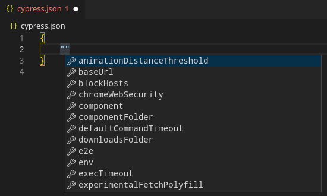
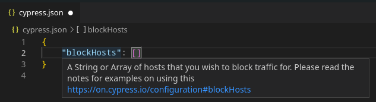

Cypress is a good tool not only because of what it offers in terms of checking the application under test, but also in terms of its integrations with other tools such as various IDEs. Let's have a look at one such integration with Visual Studio Code, or with [Code](https://archlinux.org/packages/community/x86_64/code/), which is an open source build available in Community repository in Arch-based systems that I use on my Linux machines.

Cypress by default creates a `cypress.json` config file where there could be tens of properties, so its not really easy to remember everything by heart. That's where JSON schema comes in place.

In VSCode (or its open source builds), you can go to `File => Preferences => Settings => find "JSON: Schemas" and open that config file (settings.json)`. What you can include in `json.schemas` property is the following array with an object:

```json
{
    "json.schemas": [
        {
            "fileMatch": [
                "cypress*.json"
            ],
            "url": "https://raw.githubusercontent.com/cypress-io/cypress/develop/cli/schema/cypress.schema.json"
        }
    ]
}
```

That will do two things for you:

1. provide an intellisense for your `cypress.json` file:



2. provide short tooltips explaining a particular property (config option) when you hover over it:



It's much easier to navigate the Cypress config file now when I get some help right in my IDE. It also saves some time because I don't need to go online every time I forget some config property.

Also notice I used a pattern (`cypress*.json`), that's because in Cypress, you can have more config files, e.g. `cypress.env.json` or really any name if you then use `--config-file <config-file-name>` flag with cypress open or run commands. You probably want intellisense and smart tooltips in all of these.
