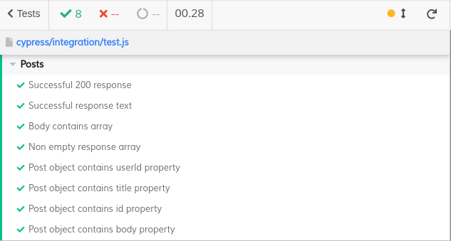

Cypress is mostly used for e2e frontend tests, but that does not mean it's the only use case available. It could also be used for API checking, which is something I'll write about today.

`cy.request()` command is basically all that's needed for some API checking. A typical example could look like the following example. I'll use `https://jsonplaceholder.typicode.com/posts` endpoint.

```javascript
/// <reference types="Cypress" />

describe('Posts', () => {
  beforeEach(() => {
    cy.request('/posts')
      .as('posts');
  });

  it('Successful 200 response', () => {
    cy.get('@posts')
      .its('status')
      .should('eq', 200);
  });
});
```

Then if I want to add another check, I'll create a new one like so:

```javascript
/// <reference types="Cypress" />

describe('Posts', () => {
  beforeEach(() => {
    cy.request('/posts')
      .as('posts');
  });

  it('Successful 200 response', () => {
    cy.get('@posts')
      .its('status')
      .should('eq', 200);
  });

  it('Successful response text', () => {
    cy.get('@posts')
      .its('statusText')
      .should('eq', 'OK');
  });
});
```

Now the problem with this approach is obvious. I keep sending a request before each check. That's a lot of network communication that takes time. It would be better to send only one request and then perform a bunch of checks on it. So what comes to mind is something like:

```javascript
/// <reference types="Cypress" />

describe('Posts', () => {
  before(() => {
    cy.request('/posts')
      .as('posts');
  });

  it('Successful 200 response', () => {
    cy.get('@posts')
      .its('status')
      .should('eq', 200);
  });

  it('Successful response text', () => {
    cy.get('@posts')
      .its('statusText')
      .should('eq', 'OK');
  });
});
```

That is changing `beforeEach()` hook to `before()` hook. But that yields this outcome:


It turns out that Cypress cleans aliases after each check (`it()`), so after "Successful 200 response" check, the alias "posts" is cleaned, so the second check fails because of that.

How to get around that?

There're a bunch of approaches the community have come up with, you can read up on that in this [issue](https://github.com/cypress-io/cypress/issues/665) on Cypress GitHub page.

Long story short, one solution could look like so:

```javascript
/// <reference types="Cypress" />

describe('Posts', () => {

  let res;

  before(() => {
    cy.request('/posts')
      .then(respose => {
        res = respose;
      });
  });

  beforeEach(() => {
    cy.wrap(res)
      .as('posts');
  });

  it('Successful 200 response', () => {
    cy.get('@posts')
      .its('status')
      .should('eq', 200);
  });

  it('Successful response text', () => {
    cy.get('@posts')
      .its('statusText')
      .should('eq', 'OK');
  });
});
```

which yields:


Following this approach, I can come up with more checks:

```javascript
/// <reference types="Cypress" />

describe('Posts', () => {

  let res;

  before(() => {
    cy.request('/posts')
      .then(respose => {
        res = respose;
      });
  });

  beforeEach(() => {
    cy.wrap(res)
      .as('posts');
  });

  it('Successful 200 response', () => {
    cy.get('@posts')
      .its('status')
      .should('eq', 200);
  });

  it('Successful response text', () => {
    cy.get('@posts')
      .its('statusText')
      .should('eq', 'OK');
  });

  it('Body contains array', () => {
    cy.get('@posts')
      .its('body')
      .should('be.a', 'array');
  });

  it('Non empty response array', () => {
    cy.get('@posts')
      .its('body')
      .should('have.length.above', 0);
  });

  [
    'userId', 'title',
    'id', 'body',
  ].forEach(property => {
    it(`Post object contains ${property} property`, () => {
      cy.get('@posts')
        .its('body')
        .then(body => {
          expect(body[0]).to.haveOwnProperty(property);
        });
    });
  });
});
```

And the result:



Notice those 280 ms. That's only thanks to the fact that I send only one request per this whole test suite. If I place the `cy.request()` into `beforeEach()` hook, the total run time would be much more:


All in all, API checking could be easily done in Cypress, although one has to know its limitations like this one with aliasing to make the whole checking as efficient as possible.
