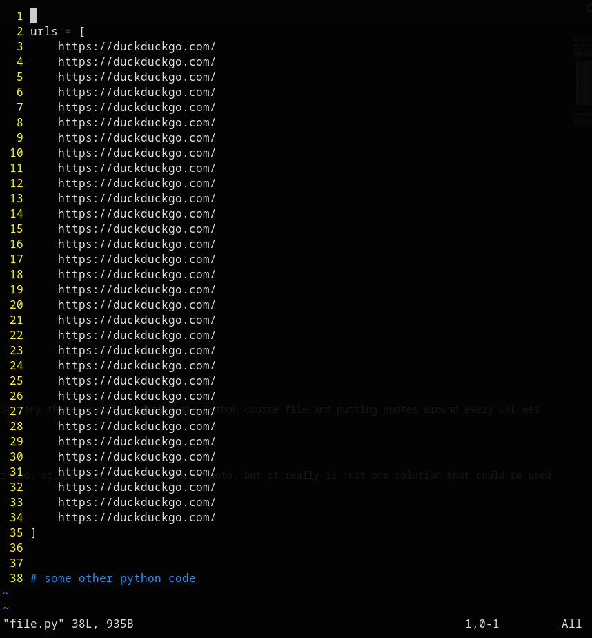
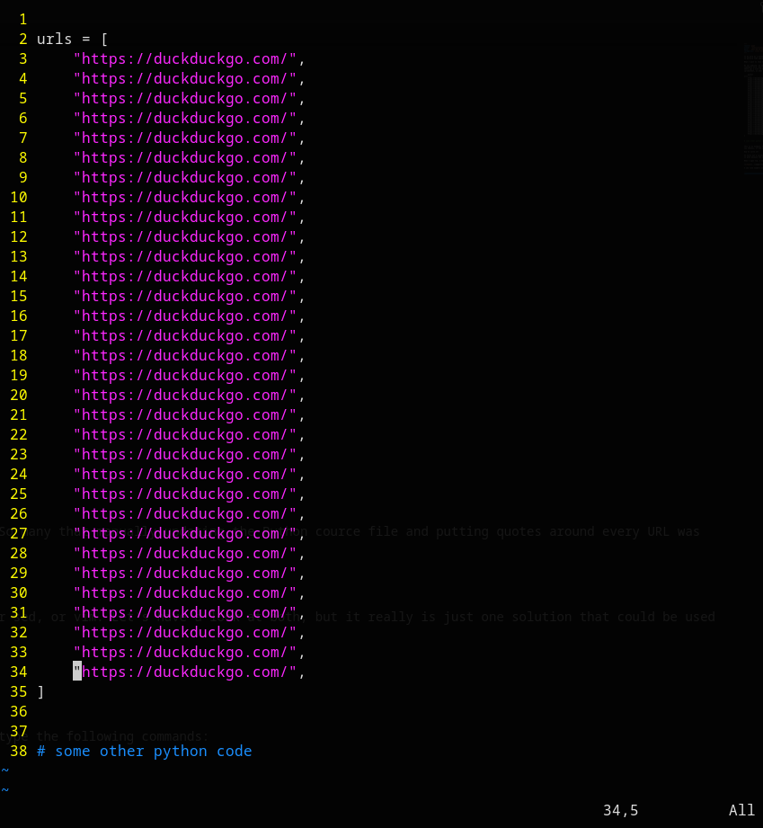

In my work as a Software Tester, I often need to work with plain text - be it some text files, source files, or web service responses. Sometimes it's necessary to perform some operation on a piece of text that really is tedious when performed manually. That's when automation comes in, or more specifically some of the tools for text processing.

What I want to show today is a task I've performed twice in last about 4-8 weeks. What is it?

On our website, we changed how some of the URLs are redirected. For example, going to URL https://abc.cz/car/a previously yielded 301 and the user ended up somewhere else, but the new routing means that this very same URL will yield 200. There were more similar changes like this one, but that's not the point. The point is there was a list of URL addresses I wanted to use in my Python script that later checked this new redirection scheme. The problem is those URLs were in an Excel spreadsheet, so when copied, there were no quotes that are necessary to use in Python to enclose strings:

 ```python
urls = [
    https://duckduckgo.com/
    https://duckduckgo.com/
    https://duckduckgo.com/
    https://duckduckgo.com/
    https://duckduckgo.com/
    https://duckduckgo.com/
    https://duckduckgo.com/
    https://duckduckgo.com/
    https://duckduckgo.com/
    https://duckduckgo.com/
    https://duckduckgo.com/
    https://duckduckgo.com/
    https://duckduckgo.com/
    https://duckduckgo.com/
    https://duckduckgo.com/
    https://duckduckgo.com/
    https://duckduckgo.com/
    https://duckduckgo.com/
    https://duckduckgo.com/
    https://duckduckgo.com/
    https://duckduckgo.com/
    https://duckduckgo.com/
    https://duckduckgo.com/
    https://duckduckgo.com/
    https://duckduckgo.com/
    https://duckduckgo.com/
    https://duckduckgo.com/
    https://duckduckgo.com/
    https://duckduckgo.com/
    https://duckduckgo.com/
    https://duckduckgo.com/
    https://duckduckgo.com/
]


# some other python code
 ```

This is an example, I think there were more addresses than this. So many that manually updating the Python source file and putting quotes around every URL was too tedious, if not impossible in a reasonable amount of time.

How to solve it?

It turns out the solution is fairly quick, just a oneliner in sed, or vim. Let's have a look at both, but it really is just one solution that could be used in both because the syntax is the same in both tools.

When I open the file in vim, I see this:



I see line numbers on the left, I will use that as addresses and type the following two commands:

```
:3,34s/https/"https/ | 3,34s/$/",/
```

After confirmation, the file looks like this:



It is now a valid Python source file, so I can continue with my checking task.

Similarly, I can use stream editor (sed):

```
$ sed '3,34s/https/"https/;3,34s/$/",/' file.py


urls = [
    "https://duckduckgo.com/",
    "https://duckduckgo.com/",
    "https://duckduckgo.com/",
    "https://duckduckgo.com/",
    "https://duckduckgo.com/",
    "https://duckduckgo.com/",
    "https://duckduckgo.com/",
    "https://duckduckgo.com/",
    "https://duckduckgo.com/",
    "https://duckduckgo.com/",
    "https://duckduckgo.com/",
    "https://duckduckgo.com/",
    "https://duckduckgo.com/",
    "https://duckduckgo.com/",
    "https://duckduckgo.com/",
    "https://duckduckgo.com/",
    "https://duckduckgo.com/",
    "https://duckduckgo.com/",
    "https://duckduckgo.com/",
    "https://duckduckgo.com/",
    "https://duckduckgo.com/",
    "https://duckduckgo.com/",
    "https://duckduckgo.com/",
    "https://duckduckgo.com/",
    "https://duckduckgo.com/",
    "https://duckduckgo.com/",
    "https://duckduckgo.com/",
    "https://duckduckgo.com/",
    "https://duckduckgo.com/",
    "https://duckduckgo.com/",
    "https://duckduckgo.com/",
    "https://duckduckgo.com/",
]


# some other python code
```

Done in a split second.

I usually use Visual Studio Code (or one of its free clones) for any code I write, but I have no idea how to make such changes in it this fast. Perhaps there is some extension I can use. Knowing some basic tools for text processing really is something that comes in handy in such situations. It can saves minutes, if not hours, over a long period of time.
