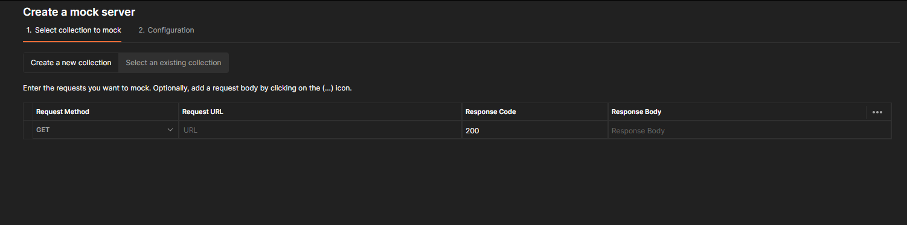
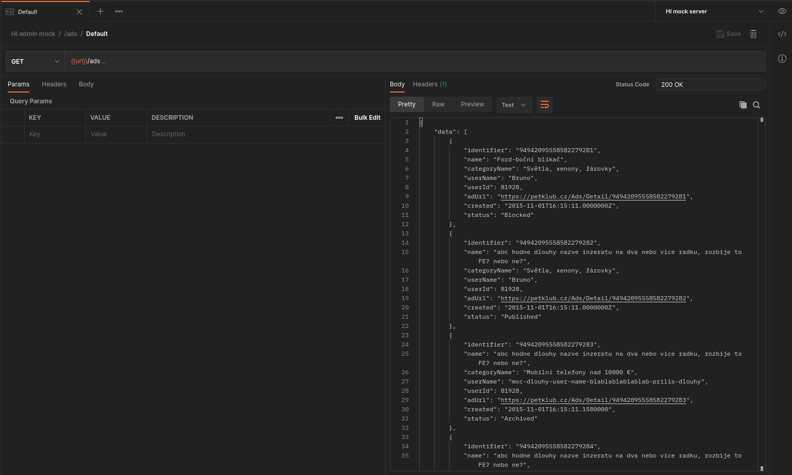
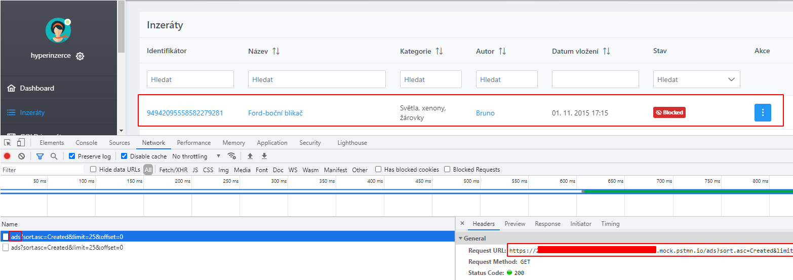
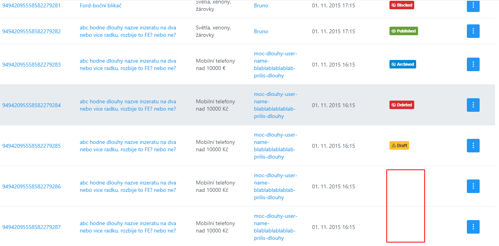

I've recently used mock servers in Postman for testing some parts of a Vue application. Perhaps it's worth writing a short article where I can share how this works. Mocking, in my view, is one of the techniques that could be useful in testing in certain situations and when testing for certain risks. It's not a magic pill, but it could be used effectively and save me a lot of time and effort.

I'll walk you through one example that uses a mock server instead of a real server. The frontend is a Vue application that communicates with a REST web service.

After cloning the repo and checking out develop branch, I can see the project root dir looks like this:

```
.
|-- LICENSE
|-- README.md
|-- auth_config.json
|-- azure-pipelines.yml
|-- babel.config.js
|-- package-lock.json
|-- package.json
|-- postcss.config.js
|-- public
|-- src
|-- tests
|-- vue.config.js
`-- web.config
```

It's worth being familiar with how JavaScript projects work, and how to work with npm, or yarn. That's really a prerequisite, otherwise I wouldn't really know what to do with this project.

When I navigate to `src/` and I can see `vars.js` file with the following content (well, I have deleted the real urls because I don't want to reveal that):

```javascript
const env = process.env.VUE_APP_ENV

const vars = {
  dev: {
    apiUrl: ""
  },
  staging: {
    apiUrl: ""
  },
  prod: {
    apiUrl: ""
  },
}

export default {
    install: app => {
        app.config.globalProperties.$vars = vars[env]
    }
}
```

At this point, I know that I want the app to communicate with my mock server instead of the real dev/staging/prod server. I have basically two options, either I decide to use the `dev` environment and change the appropriate url in the file, or I add one new object, let's say local. I'll go with the latter:

```javascript
const env = process.env.VUE_APP_ENV

const vars = {
  local: {
    apiUrl: ""
  },
  dev: {
    apiUrl: ""
  },
  staging: {
    apiUrl: ""
  },
  prod: {
    apiUrl: ""
  },
}

export default {
    install: app => {
        app.config.globalProperties.$vars = vars[env]
    }
}
```

Now I face the decision what to put there as the local `apiUrl`. That's the moment to create a mock server. I'll do it in Postman:



Postman provides a tutorial [here](https://learning.postman.com/docs/designing-and-developing-your-api/mocking-data/setting-up-mock/), but I don't think it's really worth reading too much, you can just experiement and explore a bit and you'll figure it out anyway, plus you'll train your exploration skills, so I consider this approach much better than reading a tutorial :)

Postman will generate a base url of the mock server. And this very url is exactly what I want to put into `local.apiUrl`.

What I also see in the `vars.js` file is `process.env.VUE_APP_ENV`, so when building and running the app, I need to provide an appropriate value in `VUE_APP_ENV` environment variable. I'll create an `.env.local` (in the root of the project) file for that:

```
VUE_APP_ENV=local
```

I now need to build and run the Vue app. Let's see what I have in `package.json` file in `scripts`:

```
{
    "scripts": {
		"serve-cz": "vue-cli-service serve --mode dev-cz",
		"build-dev-cz": "vue-cli-service build --mode dev-cz --dest dev-cz",
		"build-staging-cz": "vue-cli-service build --mode staging-cz --dest staging-cz",
		"build-prod-cz": "vue-cli-service build --mode prod-cz --dest prod-cz",
		"lint": "vue-cli-service lint",
		"test:unit": "vue-cli-service test:unit"
	}
}
```

Not great, not terrible, but I need more:

```
{
    "scripts": {
		"serve-local": "vue-cli-service serve --mode local",
		"serve-cz": "vue-cli-service serve --mode dev-cz",
		"build-local": "vue-cli-service build --mode local --dest local",
		"build-dev-cz": "vue-cli-service build --mode dev-cz --dest dev-cz",
		"build-staging-cz": "vue-cli-service build --mode staging-cz --dest staging-cz",
		"build-prod-cz": "vue-cli-service build --mode prod-cz --dest prod-cz",
		"lint": "vue-cli-service lint",
		"test:unit": "vue-cli-service test:unit"
	}
}
```

I added `build-local` and `server-local` scripts.

Now I can build and run the project:

```
$ npm run build-local && npm run server-local
```

If everything turns out successful (it might not because of some deprecated dependencies for example :)), I should have a local instance of the app running on something like 8080 port.

At this point, it's more about finding out what I want to test, and creating such an endpoint in the mock server with appropriate data, status codes, headers, and what not. I'm interested in a grid with ads, particularly in how the Vue app reacts to different ad statuses. From what I know from my context and backend, an ad can have several statuses, which I can confirm in a model of the backend API app:

```csharp
public enum AdStatus
{
    /// <summary>
    /// Not yet published but should be. For cases when advertisement won't pass publishing flow (image resize, etc.)
    /// </summary>
    [EnumMember(Value = "New")]
    New = 1,

    /// <summary>
    /// Is published to web and visible to all users.
    /// </summary>
    [EnumMember(Value = "Published")]
    Published = 2,

    /// <summary>
    /// Enum RejectedEnum for rejected
    /// </summary>
    [EnumMember(Value = "Rejected")]
    Rejected = 3,

    /// <summary>
    /// Enum ArchivedEnum for archived
    /// </summary>
    [EnumMember(Value = "Archived")]
    Archived = 4,

    /// <summary>
    /// Enum BlockedEnum for blocked
    /// </summary>
    [EnumMember(Value = "Blocked")]
    Blocked = 5,

    /// <summary>
    /// State when user didn't published advertisement.
    /// </summary>
    [EnumMember(Value = "Draft")]
    Draft = 6,

    /// <summary>
    /// Advertisement was removed.
    /// </summary>
    [EnumMember(Value = "Deleted")]
    Deleted = 7
}
```

And I want to see that the Vue app does what it should (e.g. displays correct ad statuses and icons) when an ad is in these different statuses. A normal approach would be to create a real ad for all of these statuses and then go to the grid to test it. But that might take a lot of time, or even be impossible because, say, the backend is not ready yet. That's why I'm going for mocking here.

I know that the grid asks for ads by calling `/ads` endpoint, so I'll add this to my mock server in Postman:



I'll go for the following response body:

```json
{
    "data": [
        {
            "identifier": "94942095558582279281",
            "name": "Ford-boční blikač",
            "categoryName": "Světla, xenony, žárovky",
            "userName": "Bruno",
            "userId": 81928,
            "adUrl": "https://example.cz/Ads/Detail/94942095558582279281",
            "created": "2015-11-01T16:15:11.0000000Z",
            "status": "Blocked"
        },
        {
            "identifier": "94942095558582279282",
            "name": "abc hodne dlouhy nazve inzeratu na dva nebo vice radku, rozbije to FE? nebo ne?",
            "categoryName": "Světla, xenony, žárovky",
            "userName": "Bruno",
            "userId": 81928,
            "adUrl": "https://example.cz/Ads/Detail/94942095558582279282",
            "created": "2015-11-01T16:15:11.0000000Z",
            "status": "Published"
        },
        {
            "identifier": "94942095558582279283",
            "name": "abc hodne dlouhy nazve inzeratu na dva nebo vice radku, rozbije to FE? nebo ne?",
            "categoryName": "Mobilní telefony nad 10000 €",
            "userName": "moc-dlouhy-user-name-blablablablablab-prilis-dlouhy",
            "userId": 81928,
            "adUrl": "https://example.cz/Ads/Detail/94942095558582279283",
            "created": "2015-11-01T16:15:11.1580000",
            "status": "Archived"
        },
        {
            "identifier": "94942095558582279284",
            "name": "abc hodne dlouhy nazve inzeratu na dva nebo vice radku, rozbije to FE? nebo ne?",
            "categoryName": "Mobilní telefony nad 10000 Kč",
            "userName": "moc-dlouhy-user-name-blablablablablab-prilis-dlouhy",
            "userId": 81928,
            "adUrl": "https://example.cz/Ads/Detail/94942095558582279284",
            "created": "2015-11-01T16:15:11.1580000",
            "status": "Deleted"
        },
        {
            "identifier": "94942095558582279285",
            "name": "abc hodne dlouhy nazve inzeratu na dva nebo vice radku, rozbije to FE? nebo ne?",
            "categoryName": "Mobilní telefony nad 10000 Kč",
            "userName": "moc-dlouhy-user-name-blablablablablab-prilis-dlouhy",
            "userId": 81928,
            "adUrl": "https://example.cz/Ads/Detail/94942095558582279285",
            "created": "2015-11-01T16:15:11.1580000",
            "status": "Draft"
        },
        {
            "identifier": "94942095558582279286",
            "name": "abc hodne dlouhy nazve inzeratu na dva nebo vice radku, rozbije to FE? nebo ne?",
            "categoryName": "Mobilní telefony nad 10000 Kč",
            "userName": "moc-dlouhy-user-name-blablablablablab-prilis-dlouhy",
            "userId": 81928,
            "adUrl": "https://example.cz/Ads/Detail/94942095558582279286",
            "created": "2015-11-01T16:15:11.1580000",
            "status": "Rejected"
        },
        {
            "identifier": "94942095558582279287",
            "name": "abc hodne dlouhy nazve inzeratu na dva nebo vice radku, rozbije to FE? nebo ne?",
            "categoryName": "Mobilní telefony nad 10000 Kč",
            "userName": "moc-dlouhy-user-name-blablablablablab-prilis-dlouhy",
            "userId": 81928,
            "adUrl": "https://example.cz/Ads/Detail/94942095558582279287",
            "created": "2015-11-01T16:15:11.1580000",
            "status": "New"
        }
    ],
    "paging": {
        "limit": 25,
        "offset": 0,
        "total": 7
    }
}
```

You can see I'm using all of the different statuses, which is what I want to focus on at the moment.

Now I'm ready to go to the Vue app to the grid with the ads. I can see the app is already calling my mock server, instead of the real server:



In the grid, I can see all the different data I created in the mock server:



I can also see that statuses Rejected and New don't have any fancy icons, not even not-fancy icons some text. That's a bug we'll probably want to fix if these two statuses are really used.

I can continue in this way, looking for more similar bugs in the Vue app. The approach is straighforward, identify some risk you want to test for, then go and create mock endpoints and data that can get you into such a situation where you can gather evidence and test for the risk. You need to have a good understanding of how the frontend app works, that is what endpoints are called when, in what sequences, and of the backend, that is what endpoints exist, what data they provide, what the structure of the data is, what the status codes are, etc.

It's also worth saying that free Postman subscription allows you to make only 1000 requests for your mock servers a month. If you need more, you'll have to pay for one of the plans Postman provides. 1000 is not really that many, so if you need to use mock servers a lot, you probably need to pay, or find a different tool.

All in all, this is about everything to it. I hope it's clearer why mocking is used in testing. The reasons are mostly the following ones:

- it allows me to test edge and corner cases in the frontend app faster; it also might be difficult, or nead impossible, to make a real server return 500 or some other error status codes, but it's easy and fast with a mock server
- it could be used for quick debugging
- it allows me to test the frontend app when the backend is not ready yet
- it can save some $$$, mock servers are definitely cheaper than a read backend; but we eventually always need a real backend!

Postman is definitely the only mock server I can use, so perhaps next time I can experiment with something else :)
