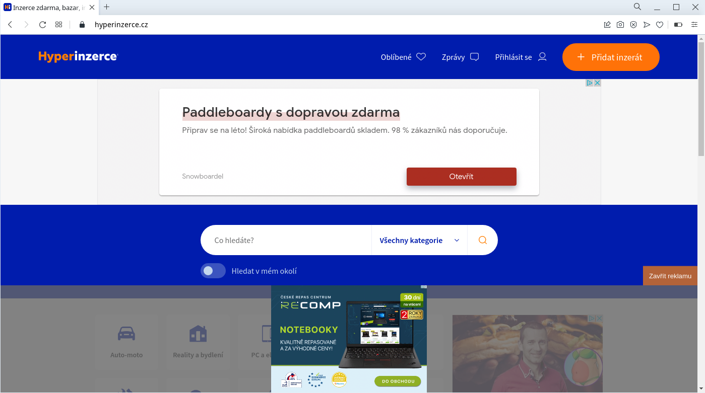
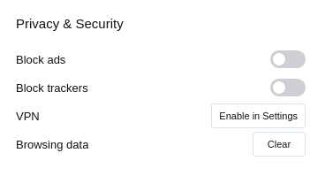
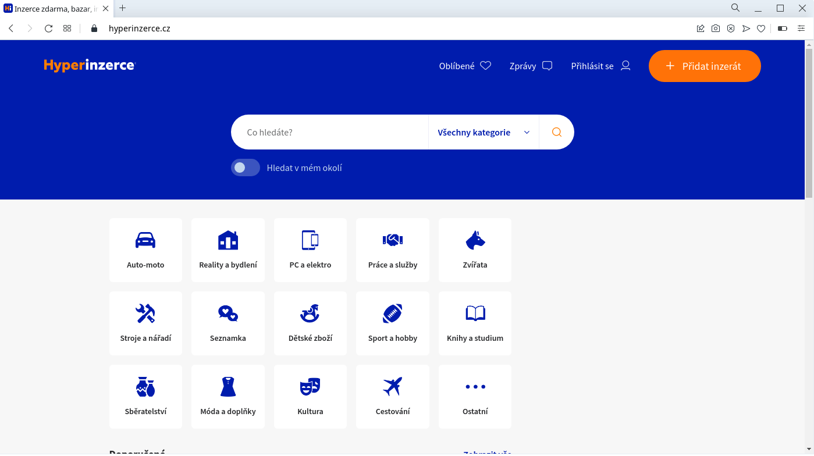

If there is something I really hate online, it's ads. I can't stand it when I visit a site and some nonsense ads start popping up. It's annoying, it slows down loading web pages, and it could compromise security. Of course, I do use AdBlock in Firefox, I have stricter browser setting but it would be nice to find another solution that perhaps could be used when I use a different browser where I haven't installed any add-on for blocking ads. It seems there's a good solution to block all this nonsense with a DNS server, the only problem is to find a good list of domains to block. But it turns out such lists do exist and are often updated, one of them is [Steven Black's hosts list on GitHub](https://github.com/StevenBlack/hosts).

How does it work then?

The point is to block or redirect DNS requests to nonsense domains that are known to provide nothing of value but ads, malware, porn, etc. The blocking/redirection could be done by updating `/etc/hosts` as suggested on the GitHub page. Or, which is my situation, I can turn that list of domains into what unbound, a local DNS resolver, understands.

I'll first download one of those hosts files:

```
$ wget -q 'https://raw.githubusercontent.com/StevenBlack/hosts/master/alternates/fakenews-gambling-porn-social/hosts'
```

First 100 lines look like this:

```
$ head -100 hosts 
# Title: StevenBlack/hosts with the fakenews, gambling, porn and social extensions
#
# This hosts file is a merged collection of hosts from reputable sources,
# with a dash of crowd sourcing via GitHub
#
# Date: 26 August 2021 20:08:13 (UTC)
# Extensions added to this file: fakenews, gambling, porn, social
# Number of unique domains: 123,791
#
# Fetch the latest version of this file: https://raw.githubusercontent.com/StevenBlack/hosts/master/alternates/fakenews-gambling-porn-social/hosts
# Project home page: https://github.com/StevenBlack/hosts
# Project releases: https://github.com/StevenBlack/hosts/releases
#
# ===============================================================

127.0.0.1 localhost
127.0.0.1 localhost.localdomain
127.0.0.1 local
255.255.255.255 broadcasthost
::1 localhost
::1 ip6-localhost
::1 ip6-loopback
fe80::1%lo0 localhost
ff00::0 ip6-localnet
ff00::0 ip6-mcastprefix
ff02::1 ip6-allnodes
ff02::2 ip6-allrouters
ff02::3 ip6-allhosts
0.0.0.0 0.0.0.0

# Custom host records are listed here.


# End of custom host records.
# Start StevenBlack

#=====================================
# Title: Hosts contributed by Steven Black
# http://stevenblack.com

0.0.0.0 wizhumpgyros.com
0.0.0.0 coccyxwickimp.com
0.0.0.0 n2019cov.000webhostapp.com
0.0.0.0 webmail-who-int.000webhostapp.com
0.0.0.0 010sec.com
0.0.0.0 01mspmd5yalky8.com
0.0.0.0 0byv9mgbn0.com
0.0.0.0 ns6.0pendns.org
0.0.0.0 dns.0pengl.com
0.0.0.0 12724.xyz
0.0.0.0 21736.xyz
0.0.0.0 www.analytics.247sports.com
0.0.0.0 2no.co
0.0.0.0 www.2no.co
0.0.0.0 logitechlogitechglobal.112.2o7.net
0.0.0.0 www.logitechlogitechglobal.112.2o7.net
0.0.0.0 2s11.com
0.0.0.0 30-day-change.com
0.0.0.0 www.30-day-change.com
0.0.0.0 mclean.f.360.cn
0.0.0.0 mvconf.f.360.cn
0.0.0.0 care.help.360.cn
0.0.0.0 eul.s.360.cn
0.0.0.0 g.s.360.cn
0.0.0.0 p.s.360.cn
0.0.0.0 aicleaner.shouji.360.cn
0.0.0.0 ssl.360antivirus.org
0.0.0.0 ad.360in.com
0.0.0.0 mclean.lato.cloud.360safe.com
0.0.0.0 mvconf.lato.cloud.360safe.com
0.0.0.0 mclean.cloud.360safe.com
0.0.0.0 mvconf.cloud.360safe.com
0.0.0.0 mclean.uk.cloud.360safe.com
0.0.0.0 mvconf.uk.cloud.360safe.com
0.0.0.0 3lift.org
0.0.0.0 448ff4fcfcd199a.com
0.0.0.0 44chan.me
0.0.0.0 4ourkidsky.com
0.0.0.0 5kv261gjmq04c9.com
0.0.0.0 88chan.pw
0.0.0.0 new.915yzt.cn
0.0.0.0 tempinfo.96.lt
0.0.0.0 abdurantom.com
0.0.0.0 abtasty.net
0.0.0.0 analytics.modul.ac.at
0.0.0.0 acalvet.com
0.0.0.0 acbras.com
0.0.0.0 graph.accountkit.com
0.0.0.0 www.graph.accountkit.com
0.0.0.0 go.ad1data.com
0.0.0.0 metrics.adage.com
0.0.0.0 adaptivecss.org
0.0.0.0 ads30.adcolony.com
0.0.0.0 androidads23.adcolony.com
0.0.0.0 events3.adcolony.com
0.0.0.0 events3alt.adcolony.com
0.0.0.0 sdk.adincube.com
0.0.0.0 app.adjust.com
0.0.0.0 cdn.admitad-connect.com
0.0.0.0 macro.adnami.io
```

I'm interested into those rows that look like `0.0.0.0 <domain>` with one exception of `0.0.0.0 0.0.0.0`:

```
$ grep -P '^0\.0\.0\.0.*[^0]$' hosts | head -30
0.0.0.0 wizhumpgyros.com
0.0.0.0 coccyxwickimp.com
0.0.0.0 n2019cov.000webhostapp.com
0.0.0.0 webmail-who-int.000webhostapp.com
0.0.0.0 010sec.com
0.0.0.0 01mspmd5yalky8.com
0.0.0.0 0byv9mgbn0.com
0.0.0.0 ns6.0pendns.org
0.0.0.0 dns.0pengl.com
0.0.0.0 12724.xyz
0.0.0.0 21736.xyz
0.0.0.0 www.analytics.247sports.com
0.0.0.0 2no.co
0.0.0.0 www.2no.co
0.0.0.0 logitechlogitechglobal.112.2o7.net
0.0.0.0 www.logitechlogitechglobal.112.2o7.net
0.0.0.0 2s11.com
0.0.0.0 30-day-change.com
0.0.0.0 www.30-day-change.com
0.0.0.0 mclean.f.360.cn
0.0.0.0 mvconf.f.360.cn
0.0.0.0 care.help.360.cn
0.0.0.0 eul.s.360.cn
0.0.0.0 g.s.360.cn
0.0.0.0 p.s.360.cn
0.0.0.0 aicleaner.shouji.360.cn
0.0.0.0 ssl.360antivirus.org
0.0.0.0 ad.360in.com
0.0.0.0 mclean.lato.cloud.360safe.com
0.0.0.0 mvconf.lato.cloud.360safe.com
```

With outbound I have two options now, either redirect domains to 0.0.0.0:

```
local-zone: "c.seznam.cz" redirect
local-data: "c.seznam.cz A 0.0.0.0"
```

or to block DNS requests with:

```
local-zone: "c.seznam.cz" always_refuse
```

The latter is shorter, so I'll go for it.

```
$ grep -P '^0\.0\.0\.0.*[^0]$' hosts | awk '{print "local-zone: \""$2"\" always_refuse"}' | head -30
local-zone: "wizhumpgyros.com" always_refuse
local-zone: "coccyxwickimp.com" always_refuse
local-zone: "n2019cov.000webhostapp.com" always_refuse
local-zone: "webmail-who-int.000webhostapp.com" always_refuse
local-zone: "010sec.com" always_refuse
local-zone: "01mspmd5yalky8.com" always_refuse
local-zone: "0byv9mgbn0.com" always_refuse
local-zone: "ns6.0pendns.org" always_refuse
local-zone: "dns.0pengl.com" always_refuse
local-zone: "12724.xyz" always_refuse
local-zone: "21736.xyz" always_refuse
local-zone: "www.analytics.247sports.com" always_refuse
local-zone: "2no.co" always_refuse
local-zone: "www.2no.co" always_refuse
local-zone: "logitechlogitechglobal.112.2o7.net" always_refuse
local-zone: "www.logitechlogitechglobal.112.2o7.net" always_refuse
local-zone: "2s11.com" always_refuse
local-zone: "30-day-change.com" always_refuse
local-zone: "www.30-day-change.com" always_refuse
local-zone: "mclean.f.360.cn" always_refuse
local-zone: "mvconf.f.360.cn" always_refuse
local-zone: "care.help.360.cn" always_refuse
local-zone: "eul.s.360.cn" always_refuse
local-zone: "g.s.360.cn" always_refuse
local-zone: "p.s.360.cn" always_refuse
local-zone: "aicleaner.shouji.360.cn" always_refuse
local-zone: "ssl.360antivirus.org" always_refuse
local-zone: "ad.360in.com" always_refuse
local-zone: "mclean.lato.cloud.360safe.com" always_refuse
local-zone: "mvconf.lato.cloud.360safe.com" always_refuse
```

That looks hopeful.

I'll now create a file with the blacklisted domains:

```
# mkdir /etc/unbound/blacklist.d
# grep -P '^0\.0\.0\.0.*[^0]$' hosts | awk '{print "local-zone: \""$2"\" always_refuse"}' > /etc/unbound/blacklist.d/bullshit-blacklist.conf
```

I need to include it for unbound, so I need to add the following into `/etc/unbound/unbound.conf`:

```
server:
	include: /etc/unbound/blacklist.d/bullshit-blacklist.conf
```

Then I reload the unbound config with:

```
# unbound-control reload
```

And it should print ok and return 0 status code if I've done everything correctly.

To test what the effects of this set-up are, I visited [hyperinzerce.cz](https://hyperinzerce.cz), which has way too many ads. The homepage after a few moments looks like this when I do not block ads in anyway:



I used Opera browser in its default setting with no ad blocking tools, what Opera offers by default was turned off:



Then I deleted the Opera cache and all browsing data, and blocked domains with unbound as shown above. After visiting the same site again, it looked much better:



I call this a significant improvement :)

I do like this a lot because I don't need to install additional browser add-ons in every single browser. I'll still use ad block and strict browser setting, but this simply is an additional action I took to filter out nonsense on the Internet.

I created a bash script I added to anacron to be run every week, so I can forget it now, and still get a fresh hosts file every now and then:

```
#!/bin/bash

resource="https://raw.githubusercontent.com/StevenBlack/hosts/master/alternates/fakenews-gambling-porn-social/hosts"
SEDSCR=/usr/share/sed-scripts

rm /tmp/hosts 2>/dev/null
wget -q -O /tmp/hosts $resource 2>/dev/null
[[ $? != 0 ]] && exit 1

grep -P '^0\.0\.0\.0.*[^0]$' /tmp/hosts | sed -f $SEDSCR/domain-whitelist.sed | awk '{print "local-zone: \""$2"\" always_refuse"}' > /etc/unbound/blacklist.d/bullshit-blacklist.conf

[[ $? != 0 ]] && exit 1
unbound-control reload &>/dev/null
```

One additional thing in this script is that I use `sed -f $SEDSCR/domain-whitelist.sed` which deletes lines with linkedin.com:

```
$ cat $SEDSCR/domain-whitelist.sed
/linkedin\.com/d
```

I consider linkedin ok for now, so I won't block it.

The ideal world would be not to put up ads on the internet in the first place. For the most part, it's useless and does not bring any real value. However, that is unlikely to happen any time soon, so such solutions are the only way to still get a pleasant browsing experience.
