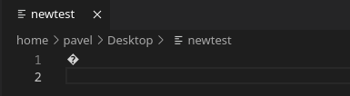
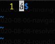
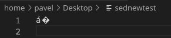
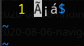

Let's have a look at a topic of encoding, which in my opinion is quite often overlooked. As a Tester, I have encountered a few cases and bugs related to encoding, so it's beneficial to be at least a bit aware of it and have it somewhere at the back of your head.

I'll first create a utf8 file with one letter `á` and convert it into a iso-8859-1 encoding:

```
$ echo "á" > test
$ iconv -f utf8 -t iso-8859-1 -o newtest test
```

Now when I check the file encoding, it should be as expected in iso-8859-1:

```
$ file -bi newtest
text/plain; charset=iso-8859-1
```

So far so good :)

The problem is it is so easy to mess up a file and end up with a mixed encoding.

Let's first see how the latter `á` is encoded in latin-1 in my file from above:

```
$ hexdump -C newtest
00000000  e1 0a                                             |..|
00000002
```

This one `á` character is encoded in one byte with hex value of `e1`. The other hex value of `0a` is a newline (LF) character.

The problem is that text editors and other tools have usually a default encoding they open files with. When I use Code-OSS, it will open the file in utf8 (by default in my case, I assume it could be changed), which basically means I won't see much:



Some other tools can perhaps guess the encoding, vim is an example of such a tool:



Let's now use something like sed and let's see what happens:

```
$ sed '1s/^/á/' newtest > sednewtest
```

As it turns out, this action did not turn out very well. Let's see what `file` reports:

```
$ file -bi sednewtest 
text/plain; charset=iso-8859-1
```

When I cat the file, it will already be obvious there's something wrong:

```
$ cat sednewtest 
á�
```

and I can confirm it with `hexdump`:

```
$ hexdump -C sednewtest 
00000000  c3 a1 e1 0a                                       |....|
00000004
```

When I leave out the newline character for now, it leaves me with three bytes `c3 a1 e1` and two characters `á`.

The problem is that sed used utf8 encoding, so it saved the latter `á` as two bytes `c3 a1`. But the same character in iso-8859-1 is encoded as one byte with hex value of `e1`.

When I open the file in Code-OSS, I can see the first `á` correctly because Code-OSS opened the file in utf8 encoding:



But when I open the file in vim, vim opens it in latin-1, so it correctly displays the second `á`:



and incorrectly the first two bytes that it interprets as being latin-1 characters, so it displays them as such. `c3` in latin-1 is `capital A tilde` and `a1` is `inverted exclamation mark`, you can check that [here](https://cs.stanford.edu/people/miles/iso8859.html).

The point of all this is that you should be aware of different encodings and the fact that many encodings are not compatible. When a file is displayed incorrectly, you should find out what encoding it is in and open it in an appropriate encoding, or convert (if possible) it to an encoding you need. All this should come before you make changes to the file because if your text editor works in a different encoding that the file is in, you will end up with mixed encoding like shown above, and there's no easy way back.
