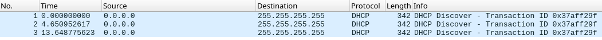

I've recently thought about DHCP, how it works and what the different use cases are. Being a Tester, I've decided to experiment a bit and gather evidence myself, rather than just reading about it from a secondary source.

I was particularly interested in what a DHCP server does when all the IP addresses on the local subnet are taken. My initial thoughts were more or less the following ones:

* a DHCP packet is sent back to inform the client that there're no more available IP addresses; this could be similar to the DHCP NAK packet that is sent in response to DHCP request packet when a concrete IP address is already taken
* nothing is sent back and the client eventually times out
* it probably depends on a DHCP server implementation, there might be differences because that's what more or less happens

With that in mind, I decided to set up a situation when a client asks for an IP address via DHCP when all addresses are already taken. Basically I changed my local subnet to 172.16.2.32/30. That left me with only two IP addresses for hosts, one was assigned to my default gateway, the other to my Android smartphone.

Running a DHCP client on wlan0 interface:

```
# dhcpcd wlan0
```

started sending DHCP discover packets as expected:



Then I just waited...

...until my client timed out:

```
# dhcpcd wlan0
...
timed out
main: control_stop: No such file or directory
```

Interesting, there's really no smarter solution to this situation than timeout. I don't really know if that's only with my DHCP server, or if this is more common, or even how things are done. I'd expect the server sends a packet that indicates that all IP addresses are taken, a similar to DHCP NAK that indicates that one particular IP address is taken; the client would then stop trying and report back that it's not possible to connect at the moment.

After this observation, I also decided to lower the [number of seconds for timeout](https://manpages.debian.org/testing/dhcpcd5/dhcpcd.conf.5.en.html#timeout):

```
# echo "timeout 15" >> /etc/dhcpcd.conf
```

Those 30 seconds by default seem to be unnecessary for my use.


