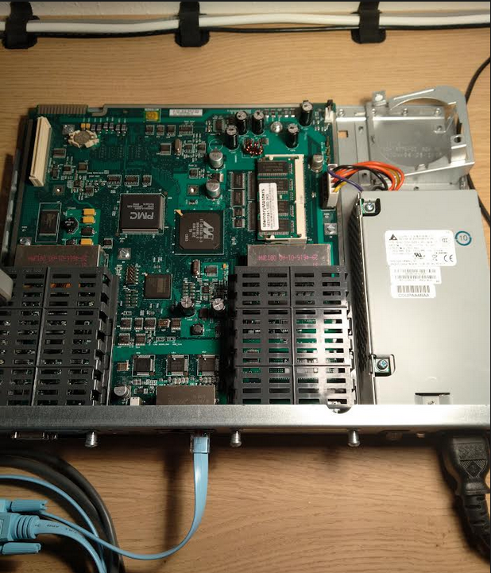

One obvious downside of having (Cisco) routers and switches next to my desk is that they can be extremely noisy. Sitting next to a router or switch that easily emits ~ 50 dB or more is not the most pleasurable experience. On the other hand, most of us simply don't have a separate room just for network devices where we can shut the door, so the question is if anything could be done with the fans these devices have.

I've recently done a little bit of research on the Internet and it turned out I'm definitely not the only one who thought about the noise coming from these devices. But it could be really difficult to make any sense of all those different comments - some people say the fans should never be removed, some say it's ok to remove them, some say it's ok to remove them only for labbing. However, the bottom line is it does seem Cisco network devices, at least some of them anyway, have no problem booting with no fans to cool them down.

One of the devices I have at home is Cisco 1841 router. This is a fairly small router that sits on my desk. Even when running, it's not even that loud, but after some time I can hear it and it can annoy me, so why not try to remove the fan and see what happens.

This is a picture after removing the fan:



Turning the device on, there was not problem booting.

The only trouble I noticed after several minutes of running it is that a log message was generated every 30 seconds:

```
*Oct  4 17:12:34.623: %ENVMON-4-FAN_LOW_RPM: Fan 1 service recommended
*Oct  4 17:13:04.639: %ENVMON-4-FAN_LOW_RPM: Fan 1 service recommended
```

which is only visible at log severity 4 or higher, so you can even turn it off, e.g.:

```
#conf t
(config)#logging console 3
```

Or you can disable logging completely, but it seems like doing too much.

Obviously I do not recommend running any real environment without fans, but for home purposes when the devices are sort of idle most of the time anyway, it seems to be just fine to remove the fans and enjoy the silence :)
