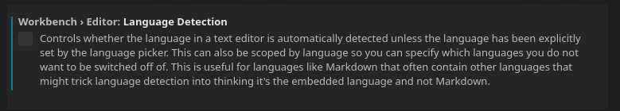

VSCode is a decent editor, but it can be annoying from time to time in its default setting. One particular thing that has been driving me crazy is the language auto detect feature.

Language auto detect means that whenever you open a file, VSCode will try to guess what format it is in and when it guesses something, it will adjust the text colors. It could be great sometimes (mostly on per language basis), but I also have some plain text files with notes where I might dump some commands and what not and whenever I opened these files, VSCode guess something like a shell script, markdown, etc.

So I decided to turn it off. It's the following option in File => Preferences => Settings:

When unchecked, VSCode should not guess.

I prefer when options are turned off by default, but it seems the default is usually the opposite nowadays, so it sometimes takes some digging around to find a way to turn something off.
