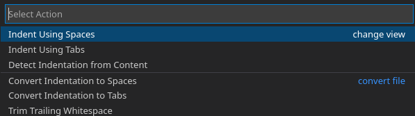

Cypress is a great tool, but as with every tool, it could be seriously misused. There are obiously various ways how to misuse the tool, but I want to focus on one particular area today, which is how clean the Cypress code is.

Let's take the following example, let's say you want to compare two dates in Cypress:

```javascript
it("Check date to be less or equal than today", () => {
    cy.get('.date').invoke('text').then(dateText => {
        const date = new Date(dateText);
        const today = new Date();
        expect(date).to.be.lte(today);
    });
});
```

Is this readable to you?

Perhaps it's not the worst example, but it is still a bit too compressed, especially this line:

```javascript
cy.get('.date').invoke('text').then(dateText => {
```

There is simply too much going on on this one line:

- getting an element
- invoking its text
- starting to work with the subject from the previous command

Three operations on one line. And it is only a simple example, you can easily see more commands crammed on one line in many examples on StackOverflow.

Now compare it to this code, which is functionally the same, just formatted differently:

```javascript
it("Check date to be less or equal than today", () => {
    cy
      .get('.date')
      .invoke('text')
      .then(dateText => {
        const date = new Date(dateText);
        const today = new Date();
        
        expect(date).to.be.lte(today);
    });
});
```

Does it read easier? How much mental effort you need to spend on understanding this code? My assumption is this is much easier to comprehend simply because you spend less time reading it.

There are basically just three changes:

- each line contains only one Cypress command
- `cy` is also on a seperate line
- there is an empty line after the variable declarations and initializations inside the callback function; or in other words, make the check stand out

I think it is much easier to read this code than reading a long chain that is on one line. Therefore, this is exactly how I format my Cypress code.

You can suggest that `expect(date).to.be.lte(today);` should be split onto multiple lines as well:

```javascript
expect(date)
  .to
  .be
  .lte(today);
```

Hm, I don't really think this improves readability anymore. Perhaps because this whole line is logically one piece whereas getting an element and invoking its text are logically less tied to each other. Or perhaps because `to`, `be`, and `lte` are shorter than `get`, `invoke`, and `then`.

Another word on this subject. Set up your IDE properly. Cypress code looks best when you use 2 spaces for indentation.

In VSCode, you can set it like so:


choose spaces:



and choose 2:


That's it for today. Simply pay attention to how you format your code. You communicate your intent in your code, so make it as easier as possible to other people who might work on your code later.
