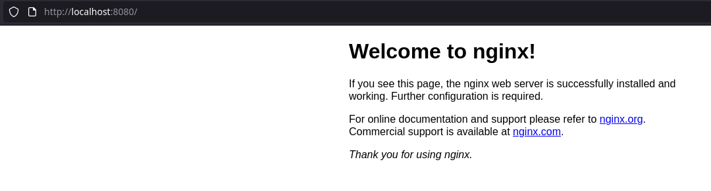

Although Docker is quite ubiquitous nowadays, there're still many who never used it. Personally, I don't use Docker every day, so I might forget bits and pieces. So this is a basic tutorial that should contain a couple of key things to get you started.

First of all, some people struggle with installation. It's worth mentioning that Docker for Windows uses basically a virtual machine (although it might be changing with WSL2), Docker for Linux should run natively using your host operating system and its capabilities. I never used Mac, so I don't know.

That said, on Windows, it's enough to run Docker Dektop and use its UI. On Linux, and perhaps Mac as well, you need to do a little bit of setup before the first use.

Docker on Linux is just a daemon like many other services you run daily. If I query my local package database with pacman on an openrc system, I can see these two packages:

```
$ pacman -Qs docker
local/docker 1:20.10.10-1
    Pack, ship and run any application as a lightweight container
local/docker-openrc 20210505-1 (openrc-galaxy)
    OpenRC docker init script
```

They also have some dependencies that pacman takes care of when installing docker.

When I install these two, I still can't really work with images and run containers, because the docker service is not running yet. So the first step is to start it:

```
$ sudo rc-service docker start
```

If you are on systemd system, it will likely be a similar command:

```
$ sudo systemctl start docker
```

And depending on whether or not you want to start the service automatically, you can enable it as well:

```
$ sudo systemctl enable docker
```

On openrc system, it's enough to add a symlink to docker init file into your default (or whatever else) run level in somewhere like `/etc/runlevels/`.

Without running the docker service, you will receive an error when you try to use the docker command (e.g. `$ docker ps -a` or anything else).

If you use a different system, you need to find out how to start services on it. You need admin or root permissions for that.

When the service is running, there might be another thing to do, and that is to add your user to `docker` group. Without that you might receive a permission error when running docker command.

```
$ sudo usermod -aG docker pavel
```

This should solve the problem. Or you can manually, or with `vigr` command, edit `/etc/group`, but that's more error prone.

Finally, it's time to explore some of the most important commands.

```
$ docker 
```

This command with no parameters will simply show a help. Docker is quite large, so one way to work with it is that the second argument is a subcommand that defines what entity you are interested in. E.g. you want to work with images, you will use `$ docker image`, you want to work with containers, you will use `$ docker container`, etc.

Ok, let's see all images:

```
$ docker image ls -a
```

If I'm unsure about what options commands might have, I can always use `--help`, e.g.:

```
$ docker image ls --help
```

Then I might want to see only running containers:

```
$ docker container ls
```

or all containers:

```
$ docker container ls -a
```

You can also see from the help, that some commands have aliases:

```
$ docker container ls --help

Usage:  docker container ls [OPTIONS]

List containers

Aliases:
  ls, ps, list

Options:
  -a, --all             Show all containers (default shows just running)
  -f, --filter filter   Filter output based on conditions provided
      --format string   Pretty-print containers using a Go template
  -n, --last int        Show n last created containers (includes all states) (default -1)
  -l, --latest          Show the latest created container (includes all states)
      --no-trunc        Don't truncate output
  -q, --quiet           Only display container IDs
  -s, --size            Display total file sizes
```

That's because `$ docker container ls` is used so often that it makes sense to shorten it to `$ docker ps`.

Let's now run some container. Obviously you can create your own images and run them as containers, but let's choose a simpler example just to see how it's done.

First, you can search for prepared images in [Docker Hub](https://hubdocker.com/). I'll choose [nginx](https://hub.docker.com/_/nginx).

Many image pages have detailed instructions on how to work with that image, so it's worth reading it.

For now, I'll just run:

```
$ docker run --name my-nginx -d -p 8080:80 nginx
Unable to find image 'nginx:latest' locally
latest: Pulling from library/nginx
eff15d958d66: Pull complete 
1e5351450a59: Pull complete 
2df63e6ce2be: Pull complete 
9171c7ae368c: Pull complete 
020f975acd28: Pull complete 
266f639b35ad: Pull complete 
Digest: sha256:097c3a0913d7e3a5b01b6c685a60c03632fc7a2b50bc8e35bcaa3691d788226e
Status: Downloaded newer image for nginx:latest
91cd3113932e04a9d70299a93e920acfdc8eb0a870ee41dad68dcaf88f4f929d
```

That means docker will look for nginx image (first localy, then in Docker Hub if not found locally) and run it as a container called `my-nginx`, which I can confirm from:

```
$ docker ps
CONTAINER ID   IMAGE     COMMAND                  CREATED         STATUS         PORTS                  NAMES
91cd3113932e   nginx     "/docker-entrypoint.…"   3 minutes ago   Up 3 minutes   0.0.0.0:8080->80/tcp   my-nginx
```

Now I can navigate to localhost 8080 port and see nginx start page:



When I'm done working with the container, I can shut it down:

```
$ docker container stop my-nginx
my-nginx
```

and:

```
$ docker ps
```

won't show an running containers anymore.

I can remove a container as well:

```
$ docker container rm my-nginx
my-nginx
```

so not even:

```
$ docker container ls -a
```

will show this one container anymore.

However, I still have the image on my local machine:

```
$ docker image ls
REPOSITORY   TAG       IMAGE ID       CREATED      SIZE
nginx        latest    ea335eea17ab   2 days ago   141MB
```

so I can eventually delete that as well:

```
$ docker image rm ea335eea17ab
Untagged: nginx:latest
Untagged: nginx@sha256:097c3a0913d7e3a5b01b6c685a60c03632fc7a2b50bc8e35bcaa3691d788226e
Deleted: sha256:ea335eea17ab984571cd4a3bcf90a0413773b559c75ef4cda07d0ce952b00291
Deleted: sha256:cc284e9b1cbed75793782165a07a0c2139d8ec0116d1d562c0e2e504ed586238
Deleted: sha256:6207e091bef7f1c94a109cb455ba163d53d7c2c641de65e71d3a0f33c0ebd8ae
Deleted: sha256:97a18ff8c6973f64d763f004cad932319a1428e0502c0ec3e671e78b2f14256b
Deleted: sha256:319130834f01416a2e8f9a4f2b2fa082c702ac21f16e0e2a206e23d53a0a3bae
Deleted: sha256:1bc375f72973dc110c9629a694bc7476bf878d244287c0214e6436afd6a9d1b0
Deleted: sha256:e1bbcf243d0e7387fbfe5116a485426f90d3ddeb0b1738dca4e3502b6743b325
```

That means I have now no images on my local machine:

```
$ docker image ls -a
REPOSITORY   TAG       IMAGE ID   CREATED   SIZE
```

These few commands are in my opinion like 80 % of what you'll ever need as a tester. In some situations you might also need to build your own images, I have done it a couple of times, but it's less common in my opinion.

What are some lessons from all this then?

First of all, there are images and containers. You use images as the basic building block, then you run containers from those images. An image is like a template, a container is more like a concrete instance.

Docker, at least on Linux, is a daemon that has to be up and running in order to use docker command. On Windows, it's enough to install Docker Desktop and follow instructions on the UI (I think it requires a reboot at some point...).

Since docker is a daemon, you manage it with your system utilities, e.g. with `systemctl`, or with `rc-service`. That has nothing to do with docker itself and you might not even find this is docker documentation. It's up to you to know and be able to manage your local machine.

Docker Hub is a repository of docker images you can use.

And last but not least, docker command has a good documentation you can use when lost, it's enough to type `$ docker help` or use `--help` option with docker commands. On reasonable systems, there's a man page as well `$ man docker`.
